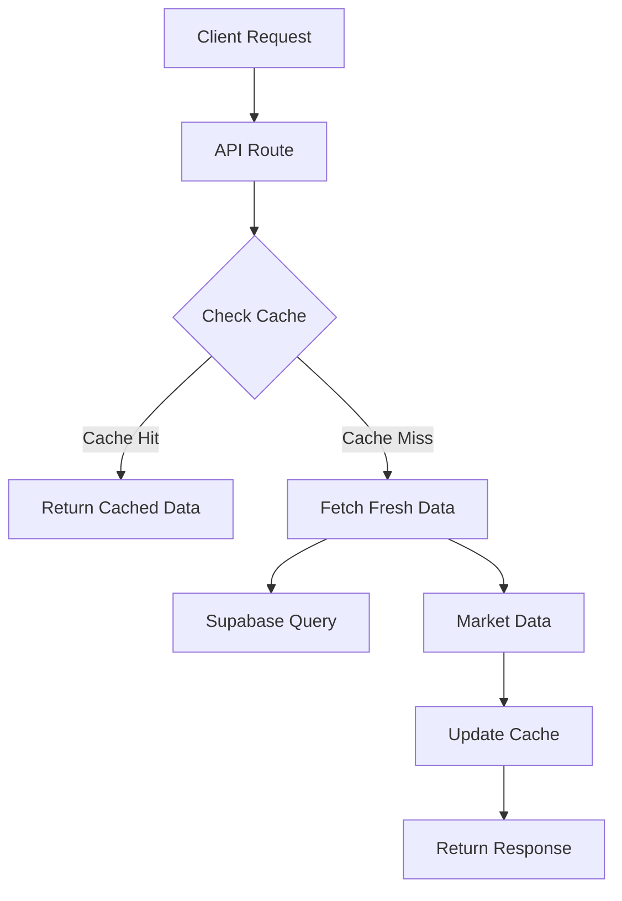
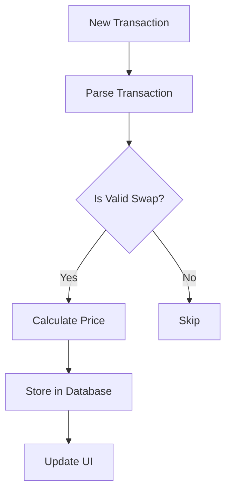

# Agent Page Documentation

## Overview

The agent page is a core component of the Swarms DEX platform that displays detailed information about individual Web3 agents, including their market data, trading interface, and historical performance. This document outlines the technical implementation and data pipeline of the agent page.

## Architecture

### Components

1. **Page Components**
   - `app/agent/[walletaddress]/page.tsx`: Main agent page component
   - `components/market-stats.tsx`: Market statistics display
   - `components/order-book.tsx`: Order book visualization
   - `components/trading-view-chart.tsx`: Price chart
   - `components/token-trading-panel.tsx`: Trading interface

2. **API Routes**
   - `/api/agent/[walletaddress]`: Main agent data endpoint
   - `/api/agent/[walletaddress]/market-stats`: Real-time market statistics
   - `/api/agent/market-data-batch`: Batch market data fetching

3. **Data Sources**
   - Supabase database (agent metadata)
   - Solana RPC (on-chain data)
   - Meteora DEX (pool and trading data)
   - CoinGecko API (SWARMS token price)

## Data Pipeline

### 1. Agent Data Fetching



#### Process Flow:
1. Client requests agent data using mint address
2. API checks Supabase cache for recent data
3. If cache is valid (< 60s old), returns cached data
4. Otherwise, fetches fresh data:
   - Agent metadata from Supabase
   - Market data from Meteora pools
   - Price data from CoinGecko
5. Updates cache and returns response

### 2. Market Data Processing

#### Pool Data Collection:
- Derives pool address using Meteora SDK
- Fetches pool state and balances
- Calculates current price and liquidity
- Processes recent transactions

#### Price Calculation:
```typescript
// Price calculation formula
priceInSwarms = swarmsBalance / tokenBalance
tokenPrice = priceInSwarms * swarmsPrice // Final USD price
```

#### Market Statistics:
- Volume (24h)
- Price change percentage
- Market cap
- APY calculation
- Pool liquidity

### 3. Real-time Updates

The page implements several update mechanisms:

1. **Polling Updates**
   - Market stats: Every 30 seconds
   - Transaction history: Every new block
   - Price data: Every 60 seconds

2. **Cache Layers**
   - In-memory cache (1 second)
   - Database cache (60 seconds)
   - CDN cache (60 seconds)

### 4. Transaction Processing



#### Transaction Data:
- Signature
- Price
- Size
- Side (buy/sell)
- Timestamp

## Caching Strategy

### 1. Database Caching
```sql
Table: meteora_pool_stats
- mint_address: string
- data: jsonb
- updated_at: timestamp
```

### 2. In-Memory Cache
```typescript
const tokenCache = new Map<string, {
  data: any,
  timestamp: number
}>();
```

### 3. CDN Headers
```typescript
headers.set('Cache-Control', 'public, s-maxage=60')
headers.set('CDN-Cache-Control', 'public, s-maxage=60')
headers.set('Vercel-CDN-Cache-Control', 'public, s-maxage=60')
```

## Error Handling

1. **Data Validation**
   - Validates mint addresses
   - Checks pool existence
   - Verifies price calculations

2. **Fallback Mechanisms**
   - Uses transaction prices if pool price is invalid
   - Falls back to agent data if pool stats unavailable
   - Defaults to zero values if all else fails

3. **Error Logging**
   - Detailed error logging with context
   - Price calculation validation
   - Transaction processing status

## Performance Considerations

1. **RPC Optimization**
   - Uses priority queue for RPC requests
   - Batches transaction fetching
   - Implements smart caching

2. **Data Loading**
   - Progressive loading of components
   - Optimistic updates
   - Debounced market data updates

3. **State Management**
   - Local state for UI updates
   - Cached state for market data
   - Optimistic updates during trading

## Security

1. **Input Validation**
   - Sanitizes wallet addresses
   - Validates transaction data
   - Checks permission levels

2. **Rate Limiting**
   - API route protection
   - Cache-first approach
   - Debounced updates

3. **Error Handling**
   - Graceful degradation
   - User feedback
   - Secure error messages

## Monitoring

1. **Performance Metrics**
   - Response times
   - Cache hit rates
   - RPC request volume

2. **Error Tracking**
   - Transaction failures
   - Price calculation errors
   - API timeouts

3. **Usage Analytics**
   - Trading volume
   - Page views
   - User interactions

## Development Guidelines

1. **Code Organization**
   - Separate concerns (UI/data/state)
   - Reusable components
   - Type safety

2. **Testing**
   - Unit tests for calculations
   - Integration tests for API
   - E2E tests for trading

3. **Deployment**
   - Staging environment
   - Feature flags
   - Rollback procedures

## RPC Implementation

### 1. Priority Queue System

The agent page uses a sophisticated RPC priority queue system to manage Solana RPC requests efficiently:

```typescript
interface RPCRequest {
  priority: 'HIGH' | 'MEDIUM' | 'LOW'
  retryCount: number
  timestamp: number
  execute: () => Promise<any>
}
```

#### Priority Levels:
- **HIGH**: Critical user actions (trading, pool creation)
- **MEDIUM**: UI updates during active trading
- **LOW**: Background data fetching, market stats

#### Queue Processing:
```typescript
class RPCPriorityQueue {
  private queue: RPCRequest[]
  private processing: boolean
  private rateLimit: number // Requests per second

  async process() {
    // Process requests based on priority and age
    // Implement exponential backoff for retries
    // Handle rate limiting
  }
}
```

### 2. RPC Operations in Agent Page

#### Critical Operations (HIGH Priority):
- Pool creation
- Trade execution
- Balance checks
- Transaction signing

```typescript
// Example of trading operation
const executeTrade = async () => {
  return rpcClient.enqueue({
    priority: 'HIGH',
    execute: () => sendTradeTransaction(...)
  })
}
```

#### Market Data (LOW Priority):
- Pool state updates
- Transaction history
- Price calculations
- TVL updates

```typescript
// Example of market data fetch
const getPoolState = async () => {
  return rpcClient.enqueue({
    priority: 'LOW',
    execute: () => fetchPoolState(...)
  })
}
```

### 3. RPC Error Handling

#### Retry Strategy:
```typescript
const retryStrategy = {
  HIGH: { maxRetries: 5, backoff: 1000 }, // 1s base
  MEDIUM: { maxRetries: 3, backoff: 2000 }, // 2s base
  LOW: { maxRetries: 2, backoff: 5000 } // 5s base
}
```

#### Error Categories:
1. **Network Errors**
   - Connection timeouts
   - Rate limiting
   - Node failures

2. **Transaction Errors**
   - Insufficient funds
   - Invalid instructions
   - Simulation failures

3. **State Errors**
   - Account not found
   - Invalid account data
   - Stale data

### 4. RPC Optimization Techniques

#### Connection Management:
```typescript
class RPCConnectionManager {
  private connections: Map<string, Connection>
  private healthChecks: Map<string, number>

  // Round-robin between healthy endpoints
  getNextHealthyEndpoint() {...}
  
  // Monitor endpoint health
  updateHealth(endpoint: string, success: boolean) {...}
}
```

#### Request Batching:
```typescript
interface BatchRequest {
  requests: RPCRequest[]
  deadline: number
  execute: () => Promise<any[]>
}

// Batch similar requests within 100ms window
const batchGetAccounts = async (accounts: PublicKey[]) => {
  return batchManager.add({
    type: 'getMultipleAccounts',
    keys: accounts,
    window: 100
  })
}
```

#### Cache Integration:
```typescript
interface RPCCache {
  data: any
  timestamp: number
  ttl: number
}

// Different TTLs for different data types
const cacheTTL = {
  poolState: 1000, // 1s
  transactions: 5000, // 5s
  tokenBalance: 2000 // 2s
}
```

### 5. RPC Monitoring

#### Performance Metrics:
```typescript
interface RPCMetrics {
  requestCount: number
  successRate: number
  averageLatency: number
  queueLength: number
  priorityDistribution: Record<Priority, number>
}
```

#### Health Checks:
- Endpoint response times
- Error rates by endpoint
- Queue backlog monitoring
- Rate limit warnings

#### Logging:
```typescript
// Structured logging for RPC operations
logger.info('RPC Request', {
  operation: 'getPoolState',
  priority: 'LOW',
  latency: 150,
  endpoint: 'mainnet-1',
  cacheStatus: 'MISS'
})
``` 