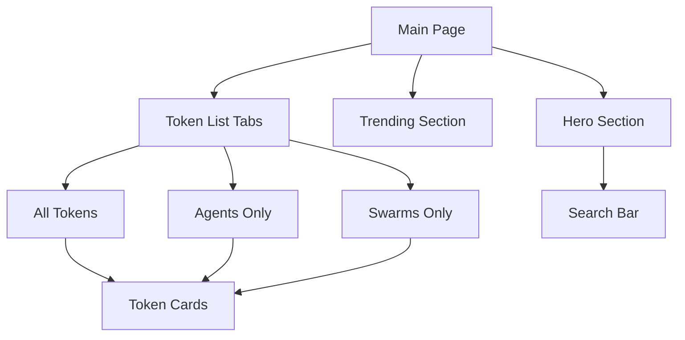
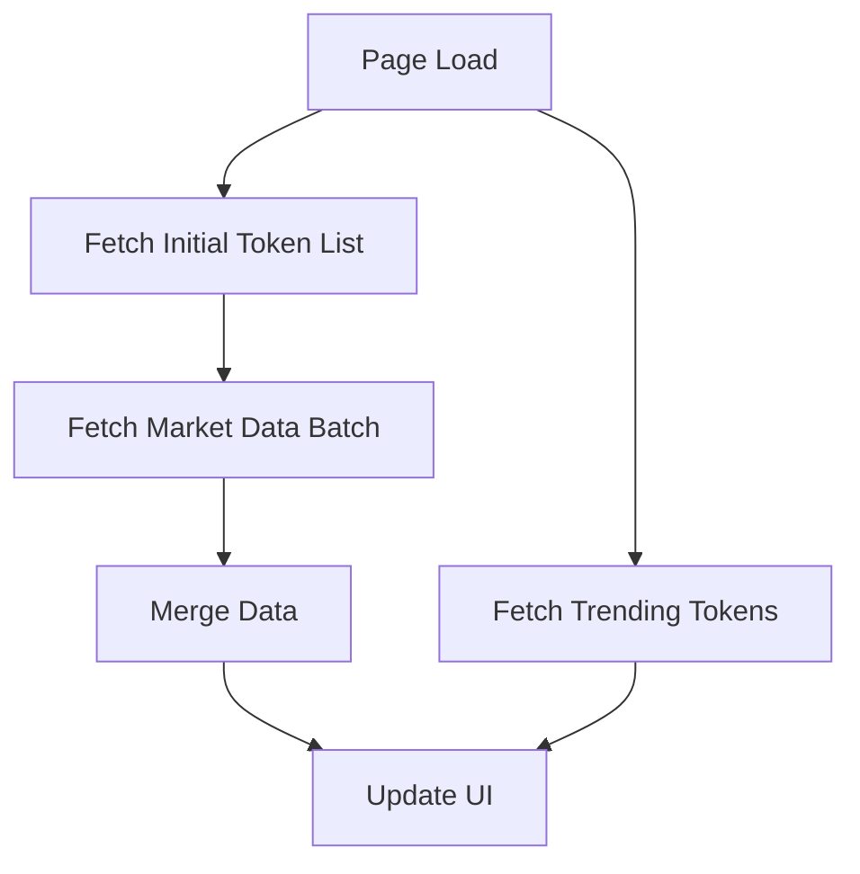

# Main Page Documentation

## Overview

The main page (`app/page.tsx`) serves as the primary entry point for the Swarms DEX platform. It provides a comprehensive view of all available tokens, including both individual agents and swarms, with real-time market data and filtering capabilities.

## Architecture

### Component Structure



### Key Components

1. **TokenCard Component**
   ```typescript
   interface TokenCardProps {
     token: Web3Agent & {
       price_change_24h?: number
       market?: {
         stats?: {
           price: number
           volume24h: number
           apy: number
           marketCap: number
         }
       }
     }
   }
   ```
   - Displays individual token information
   - Handles price formatting with 13 decimal places
   - Implements hover animations and transitions
   - Shows verification badges and token types

2. **Search Implementation**
   ```typescript
   const [searchQuery, setSearchQuery] = useState("")
   const debouncedSearch = useDebounce(searchQuery, 300)
   ```
   - Debounced search to prevent excessive API calls
   - Updates results in real-time
   - Case-insensitive search across token properties

## Data Flow

### 1. Initial Data Loading



#### Implementation Details:
```typescript
useEffect(() => {
  const fetchTokens = async () => {
    // 1. Fetch base token data
    const fetchedTokens = await listTokens({
      limit: 50,
      search: debouncedSearch,
      orderBy: "created_at",
      include_market_data: true
    })

    // 2. Fetch market data in batch
    const mintAddresses = fetchedTokens.map(token => token.mint_address)
    const marketData = await fetchMarketDataBatch(mintAddresses)

    // 3. Merge and update state
    const updatedTokens = mergeTokensWithMarketData(fetchedTokens, marketData)
    setTokens(updatedTokens)
  }
}
```

### 2. Market Data Updates

#### Current Implementation:
```typescript
const fetchMarketDataBatch = async (mintAddresses: string[]) => {
  const response = await fetch('/api/agent/market-data-batch', {
    method: 'POST',
    headers: { 'Content-Type': 'application/json' },
    body: JSON.stringify({ mintAddresses })
  })
  return response.json()
}
```

#### Recommended RPC Implementation:
```typescript
const fetchMarketDataBatch = async (mintAddresses: string[]) => {
  return rpcClient.enqueue({
    priority: 'LOW',
    execute: async () => {
      const batchSize = 20
      const batches = []
      
      // Split into smaller batches
      for (let i = 0; i < mintAddresses.length; i += batchSize) {
        const batch = mintAddresses.slice(i, i + batchSize)
        batches.push(batch)
      }

      // Process batches with rate limiting
      const results = await Promise.all(
        batches.map(batch => 
          rpcClient.getMultipleAccountsInfo(batch)
        )
      )

      return processMarketDataResults(results)
    }
  })
}
```

## State Management

### 1. Primary State
```typescript
const [tokens, setTokens] = useState<Web3Agent[]>([])
const [trendingTokens, setTrendingTokens] = useState<Web3Agent[]>([])
const [loading, setLoading] = useState(true)
const [error, setError] = useState<string | null>(null)
```

### 2. Derived State
```typescript
const agents = tokens.filter((token) => !token.is_swarm)
const swarms = tokens.filter((token) => token.is_swarm)
```

## Performance Optimizations

### 1. Data Fetching
- Batch requests for market data
- Debounced search queries
- Cached trending tokens
- Progressive loading of token data

### 2. Rendering
- Virtualized list for large datasets
- Optimized re-renders with proper memoization
- Lazy loading of images
- Efficient state updates

### 3. RPC Optimization Needs
```typescript
// Current bottlenecks:
// 1. Single large batch request
// 2. No request prioritization
// 3. Limited error handling
// 4. No connection management

// Recommended improvements:
interface RPCConfig {
  maxBatchSize: number
  retryAttempts: number
  priorityLevel: 'HIGH' | 'MEDIUM' | 'LOW'
  timeout: number
}

class MainPageRPCManager {
  private rpcClient: RPCClient
  private config: RPCConfig

  constructor(config: RPCConfig) {
    this.config = config
    this.rpcClient = new RPCClient({
      endpoints: [
        'https://primary.rpc.endpoint',
        'https://backup1.rpc.endpoint',
        'https://backup2.rpc.endpoint'
      ],
      maxRetries: config.retryAttempts,
      timeout: config.timeout
    })
  }

  async fetchMarketData(mintAddresses: string[]) {
    return this.rpcClient.batchProcess({
      data: mintAddresses,
      batchSize: this.config.maxBatchSize,
      priority: this.config.priorityLevel,
      processor: this.processMarketDataBatch
    })
  }
}
```

## Error Handling

### 1. Network Errors
```typescript
try {
  const marketData = await fetchMarketDataBatch(mintAddresses)
} catch (error) {
  if (error instanceof NetworkError) {
    handleNetworkError(error)
  } else if (error instanceof RPCError) {
    handleRPCError(error)
  } else {
    handleGenericError(error)
  }
}
```

### 2. Data Validation
```typescript
const validateMarketData = (data: any): boolean => {
  return (
    data &&
    typeof data.price === 'number' &&
    typeof data.volume24h === 'number' &&
    typeof data.marketCap === 'number'
  )
}
```

### 3. Fallback Mechanisms
```typescript
const getFallbackPrice = (token: Web3Agent) => {
  return token.current_price || token.market?.stats?.price || 0
}
```

## UI Components

### 1. Token Card Layout
```typescript
<Card className="group bg-black/50 border border-red-500/20">
  <CardHeader>
    <TokenInfo />
    <PriceDisplay />
  </CardHeader>
  <CardContent>
    <MarketStats />
  </CardContent>
  <CardFooter>
    <SocialLinks />
    <ActionButtons />
  </CardFooter>
</Card>
```

### 2. Responsive Design
```typescript
const gridColumns = {
  base: "1",
  md: "2",
  lg: "3"
}
```

## Testing Strategy

### 1. Unit Tests
```typescript
describe('TokenCard', () => {
  it('formats price correctly', () => {
    const price = 0.0000000123456
    expect(formatPrice(price)).toBe('0.0000000123456')
  })
})
```

### 2. Integration Tests
```typescript
describe('Market Data Fetching', () => {
  it('handles RPC failures gracefully', async () => {
    // Test implementation
  })
})
```

## Monitoring and Analytics

### 1. Performance Metrics
```typescript
interface PageMetrics {
  loadTime: number
  rpcLatency: number
  renderTime: number
  errorRate: number
}
```

### 2. User Interactions
```typescript
interface UserEvents {
  searchQueries: string[]
  tabSwitches: number
  cardClicks: number
}
```

## Future Improvements

1. **RPC Optimization**
   - Implement connection pooling
   - Add request prioritization
   - Improve error handling
   - Add circuit breaker pattern

2. **UI Enhancements**
   - Add sorting capabilities
   - Implement advanced filters
   - Add price alerts
   - Improve mobile experience

3. **Performance**
   - Implement WebSocket updates
   - Add service worker for offline support
   - Optimize image loading
   - Improve caching strategy 